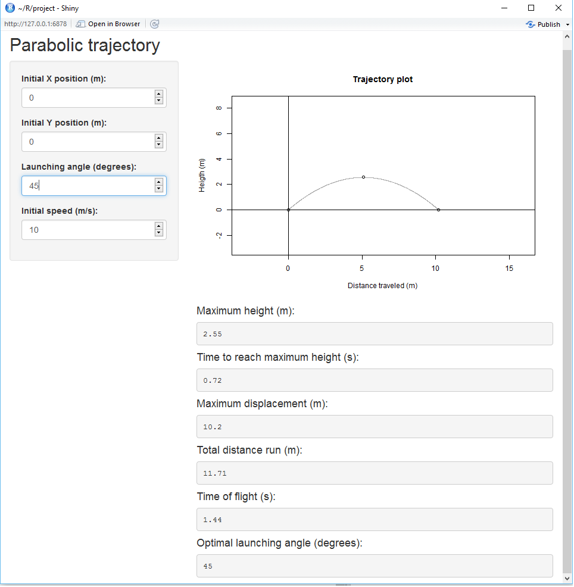

Simulation of projectile trajectory neglecting air resistance
========================================================
author: André Amorim
date: fevereiro, 13-2016
Application available at: https://andre1989.shinyapps.io/developing_data_products-shiny/
Documentation available at: https://github.com/Andre1989/developing-data-products

Introduction
========================================================

An easy interface to simulate the trajectory of a projectile was developed. 

Features:

- An input box for the user to specify some initial parameters.
- A plot depicting the projectile trajectory.
- A printing area displaying  some interesting parameters about the projectile movement.

***

Basic physics concepts about projectiles
========================================================

Projectile motion is a form of motion in which an object or particle (called a projectile) is thrown near the earth's surface, and it moves along a curved path under the action of gravity only. 

- Since the air resistance is neglected, the only force of significance that acts on the object is gravity, which acts downward to cause a downward acceleration. 
- Because of the object's inertia, no external horizontal force is needed to maintain the horizontal motion.

Mathematical formulas
========================================================
Parametric equations:
  - $x(t) = x_0 + v_0tcos(\theta)$
  - $y(t) = y_0 + v_0tsin(\theta) - \frac{1}{2}gt^2$
  
Optimal launching angle:
  - $\theta_{optimal} = arctan(\frac{v_0^2}{sqrt(v_0^2+2gy_0)})$
  
More information at:
- https://en.wikipedia.org/wiki/Projectile_motion
- http://math.stackexchange.com/questions/692179/finding-the-ideal-angle-for-the-maximum-range-of-a-projectile-when-elevated

What the application does
========================================================

The user sets some initial parameters:
- Initial projectile velocity
- Launching angle
- Initial position and heigth

The application then plots the trajectory of the projectile and computes some parameters about the projectile movement:
- Maximum height reached by the projectile and time to reach it
- Total flying time
- Distance run by the projectile and displacement from the initial position
- Optimal launching angle
